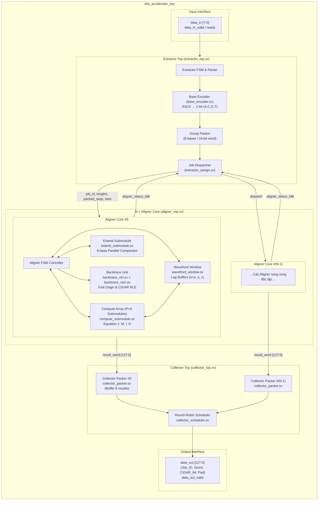
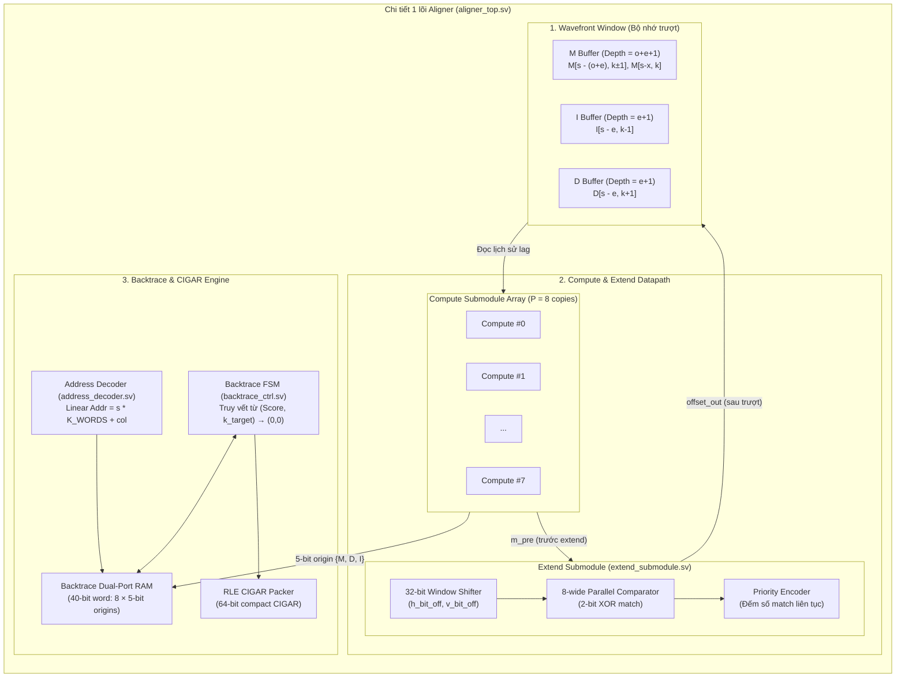
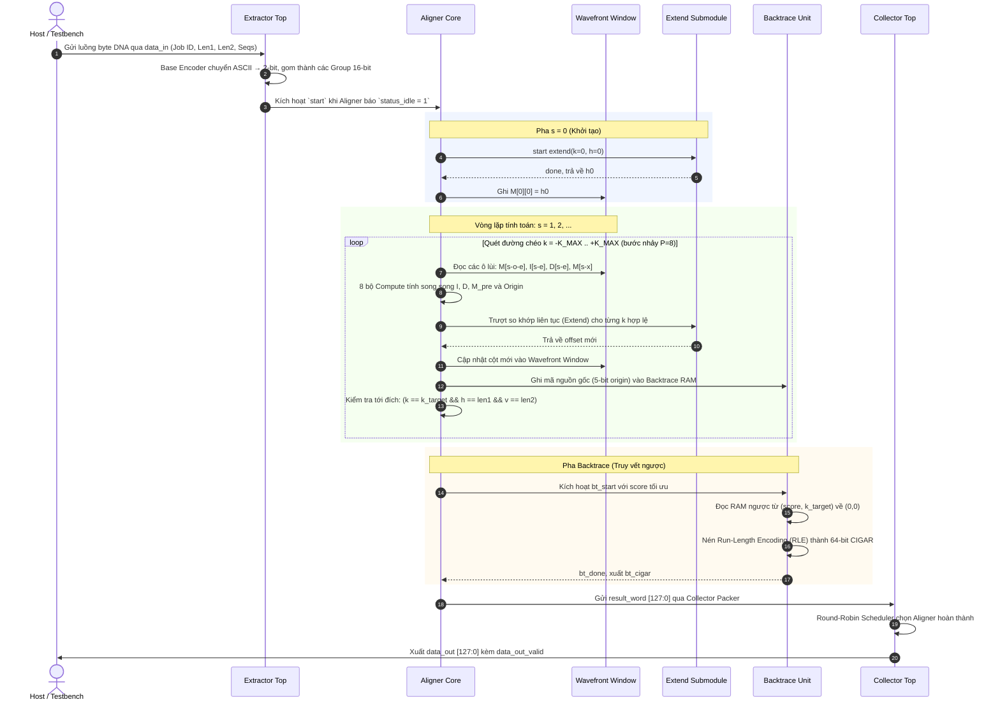
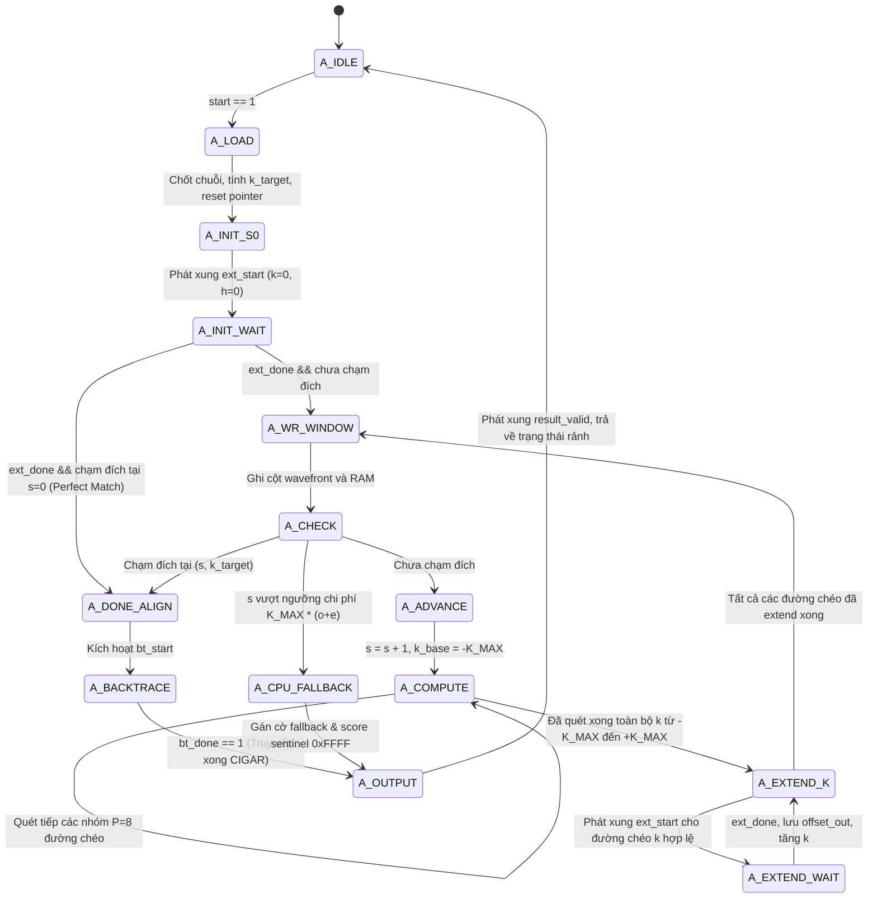
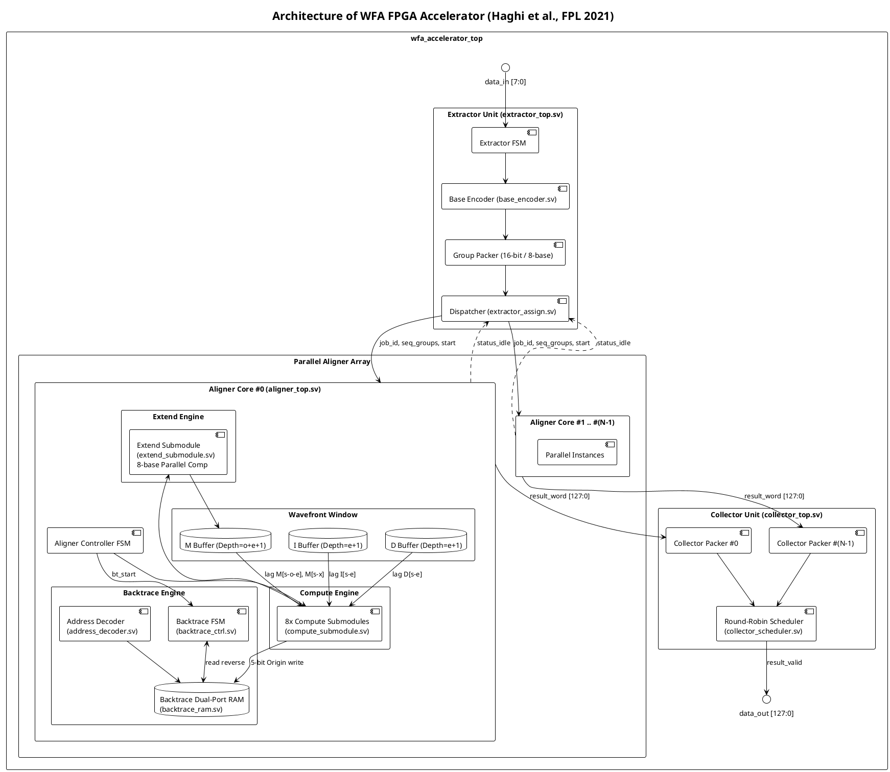

# WFA-FPGA Accelerator — Triển Khai Lại Bằng RTL

Triển khai lại (RTL, SystemVerilog) kiến trúc bộ tăng tốc FPGA cho thuật toán
**Wavefront Alignment (WFA)** dùng trong căn chỉnh cặp trình tự gen (genomic
pairwise alignment).

> **Tham chiếu gốc:** A. Haghi, S. Marco-Sola, L. Alvarez, D. Diamantopoulos,
> C. Hagleitner, M. Moreto, *"An FPGA Accelerator of the Wavefront Algorithm
> for Genomics Pairwise Alignment"*, 2021 31st International Conference on
> Field-Programmable Logic and Applications (FPL), DOI: 10.1109/FPL53798.2021.00033.

---

## 1. Tổng quan

Hệ thống gồm 3 tầng chính chạy trên FPGA, giao tiếp với CPU qua kênh dữ liệu
byte-stream:

1. **Extractor** — tiếp nhận trình tự DNA thô (ASCII), nén 2-bit/base, đóng
   gói theo nhóm 8 base, phân công cặp trình tự cho lõi Aligner đang rảnh.
2. **N x Aligner Core** — mỗi lõi chạy độc lập thuật toán WFA
   (extend -> compute -> backtrace) cho 1 cặp trình tự, N lõi chạy song song.
3. **Collector** — thu thập kết quả (compact CIGAR) từ tất cả Aligner, đóng
   gói thành từ 128-byte, xuất ra ngoài theo lịch trọng tài round-robin.

Tài liệu đặc tả chi tiết (danh sách tham số, interface từng module, công thức
toán học) nằm trong [`WFA_FPGA_RTL_SPEC.md`](./WFA_FPGA_RTL_SPEC.md).

---

## 2. Cấu trúc repo (đề xuất)

```
.
├── README.md                      # file này
├── WFA_FPGA_RTL_SPEC.md           # đặc tả thiết kế chi tiết cho agent/kỹ sư RTL
├── rtl/
│   ├── pkg_wfa_params.sv          # package tham số dùng chung
│   ├── base_encoder.sv            # mã hóa ASCII -> 2-bit (A,C,G,T)
│   ├── extractor_assign.sv        # đóng gói nhóm 8-base + dispatch job
│   ├── extractor_top.sv
│   ├── extend_submodule.sv        # so sánh 8-base song song, extend()
│   ├── compute_submodule.sv       # công thức I/D/M (Equation 1)
│   ├── wavefront_window.sv        # bộ nhớ cửa sổ trượt (lag buffer)
│   ├── backtrace_ram.sv           # RAM lưu origin 5-bit/ô
│   ├── address_decoder.sv         # giải mã địa chỉ backtrace
│   ├── backtrace_ctrl.sv          # FSM truy vết ngược + nén RLE CIGAR
│   ├── aligner_top.sv             # ghép 1 lõi Aligner hoàn chỉnh
│   ├── collector_packer.sv        # gom 8 kết quả -> 1 từ 128-byte
│   ├── collector_scheduler.sv     # trọng tài round-robin
│   ├── collector_top.sv
│   └── wfa_accelerator_top.sv     # top-level, generate N Aligner
├── tb/
│   ├── tb_extend_submodule.sv
│   ├── tb_compute_submodule.sv
│   ├── tb_backtrace_ctrl.sv
│   ├── tb_aligner_top.sv
│   └── tb_wfa_accelerator_top.sv
└── scripts/
    └── gen_reference_vectors.py   # mô hình phần mềm sinh test-vector đối chiếu
```

---

## 3. Tham số thiết kế chính

| Tham số | Ý nghĩa | Giá trị mặc định |
|---|---|---|
| `X_PEN` | mismatch penalty | 4 |
| `O_PEN` | gap-open penalty | 6 |
| `E_PEN` | gap-extend penalty | 2 |
| `K_MAX` | giới hạn đường chéo (-K..+K) | 32 |
| `SEQ_LEN_MAX` | độ dài trình tự tối đa | 150 |
| `P_SUBMODULES` | số cặp Extend/Compute song song | 8 |
| `BLOCK_SIZE` | số base/nhóm đóng gói | 8 |
| `NUM_ALIGNERS` | số lõi Aligner trên 1 FPGA | 64 |
| `BT_RAM_WIDTH` | độ rộng Backtrace RAM | 40 bit |
| `BT_RAM_DEPTH` | độ sâu Backtrace RAM | 250 từ |

Độ rộng cửa sổ wavefront: `window_I = E_PEN`, `window_D = E_PEN`,
`window_M = max(X_PEN, O_PEN + E_PEN)`.

---

## 4. Sơ đồ kiến trúc

### 4.1 Sơ đồ khối toàn hệ thống



### 4.2 Chi tiết bên trong 1 lõi Aligner



### 4.3 Sơ đồ tuần tự xử lý dữ liệu



### 4.4 Máy trạng thái FSM của 1 lõi Aligner



### 4.5 Sơ đồ component (PlantUML)

Nếu dùng PlantUML (VS Code extension, IntelliJ, hoặc plantuml.com), tạo file
`docs/architecture.puml` với nội dung sau:



---

## 5. Trạng thái dự án

| Hạng mục | Trạng thái |
|---|---|
| Đặc tả kiến trúc (`WFA_FPGA_RTL_SPEC.md`) | Hoàn thành |
| Sơ đồ UML/Mermaid/PlantUML | Hoàn thành (file này) |
| Mô hình phần mềm tham chiếu (Python) | Hoàn thành (`scripts/gen_reference_vectors.py`) |
| RTL các module (`rtl/*.sv`) | Chưa triển khai — xem prompt agent trong `WFA_FPGA_RTL_SPEC.md` |
| Testbench (`tb/*.sv`) | Chưa triển khai |
| Synthesis / timing closure (Vivado, Xilinx UltraScale+) | Chưa thực hiện |

> **Lưu ý:** các sơ đồ và đặc tả trong repo mô tả đúng tinh thần kiến trúc và
> công thức toán học trong bài báo FPL 2021, nhưng **chưa được đối chiếu với
> RTL/silicon thật** của nhóm tác giả (repo gốc: `gitlab.bsc.es/ahaghi/wfa_fpga_accelerator`).
> Các chi tiết vi mạch cụ thể (định dạng địa chỉ Backtrace RAM, độ sâu FIFO
> Scheduler...) là đề xuất thiết kế hợp lý dựa trên mô tả trong bài báo, cần
> được kiểm chứng bằng mô phỏng trước khi tổng hợp (synthesis).

---

## 6. Cách sử dụng (dự kiến)

```bash
# 1. Sinh test-vector tham chiếu từ mô hình phần mềm
python3 scripts/gen_reference_vectors.py --out tb/vectors/

# 2. Chạy mô phỏng (ví dụ dùng Verilator hoặc trình mô phỏng SystemVerilog)
#    (thay bằng công cụ mô phỏng bạn đang dùng)
verilator --binary -j 0 -sv rtl/*.sv tb/tb_wfa_accelerator_top.sv
./obj_dir/Vtb_wfa_accelerator_top

# 3. (Tương lai) Tổng hợp cho Xilinx UltraScale+ qua Vivado
vivado -mode batch -source scripts/build_bitstream.tcl
```

---

## 7. Tài liệu tham khảo

- A. Haghi et al., *"An FPGA Accelerator of the Wavefront Algorithm for
  Genomics Pairwise Alignment"*, FPL 2021.
- S. Marco-Sola, J. C. Moure, M. Moreto, A. Espinosa, *"Fast gap-affine
  pairwise alignment using the wavefront algorithm"*, Bioinformatics, 2020.
- Xem chi tiết đặc tả trong [`WFA_FPGA_RTL_SPEC.md`](./WFA_FPGA_RTL_SPEC.md).